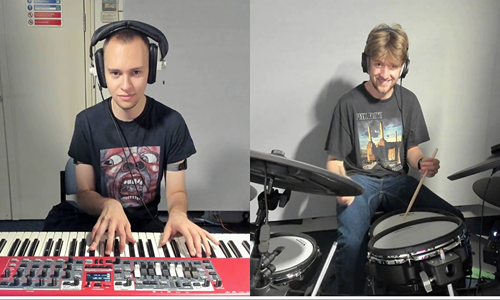

Coordination between participants is a necessary foundation for successful human interaction. This is especially true in group musical performances, where action must often be temporally coordinated between the members of an ensemble in order for their performance to be effective. Networked mediation can disrupt this coordination process by introducing a delay between when a musical sound is produced and when it is received. This can result in significant deteriorations in synchrony and stability between performers. Here we show that five duos of professional jazz musicians adopt diverse strategies when confronted by the difficulties of coordinating performances over a network — difficulties that are not exclusive to networked performance, but are also present in other situations (such as when coordinating performances over large physical spaces). What appear to be two alternatives involve (i) one musician being led by the other, tracking the timings of the leader's performance, or (ii) both musicians accommodating to each other, mutually adapting their timing. During networked performance, these two strategies favor different sides of the trade-off between, respectively, tempo synchrony and stability; in the absence of delay, both achieve similar outcomes. Our research highlights how remoteness presents new complexities and challenges to successful interaction.